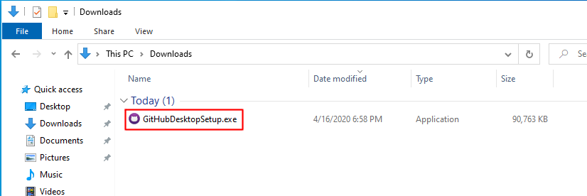
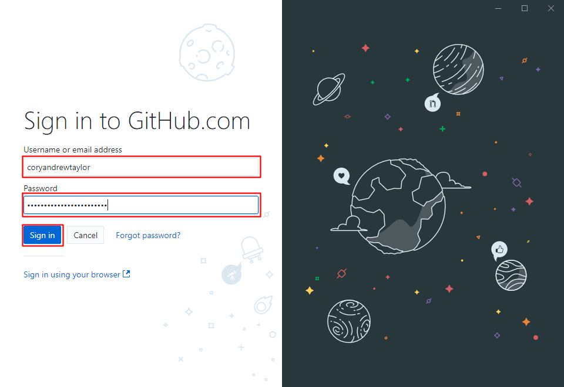

# Download Installer

1. Download the GitHub Desktop for Windows installer (https://central.github.com/deployments/desktop/desktop/latest/win32).
2. Once the download is complete, run the installer (GitHubDesktopSetup.exe).

# Installation Starts

When you run the installer, a splash screen will pop up onscreen.

# Sign in to GitHub, pt. 1

After the splash screen, you will be prompted to sign into GitHub.

Click "Sign in to GitHub.com"

# Sign in to GitHub, pt. 2

On the next screen,

1. Enter your GitHub username and password.
2. Click the "Sign In" button.

# Configure Git

On the "Configure Git" screen,

1. Enter your name in the "Name" field.
2. Enter your email address in the "Email" field.
3. Click the "Continue" button.

# Usage Data Opt-Out

On the "Make GitHub Desktop better!" screen, you can opt out of sending data to GitHub about how you use GitHub Desktop.

If you want to send usage data, leave the "Yes, send periodic usage stats" checkbox checked.

If you don't want to send your data, uncheck the the "Yes, send periodic usage stats" checkbox.

Whichever you choose, click the "Finish" button.

# Get Started with GitHub Desktop

On the "Let's get started!" page, click "Clone a repository from the Internet..."

# Clone Module Repo

On the "Clone a repository" page,

1. Enter `https://github.com/coryandrewtaylor/IntroToPython` in the "Repository URL" field.
2. Leave the "Local path" field set to its default value.
3. Click the "Clone" button.

# Fetch Origin

When the cloning process has completed, the screen will change to show you your local version of the repo.

On the repo screen, click the "Fetch origin" button.

# Show Files

When the fetch is complete (the "Fetch origin" button will say "Last fetched just now"), click the "Show in Explorer" button.

# Navigate to 01 Folder

# Run install_vs_code_ext.bat
