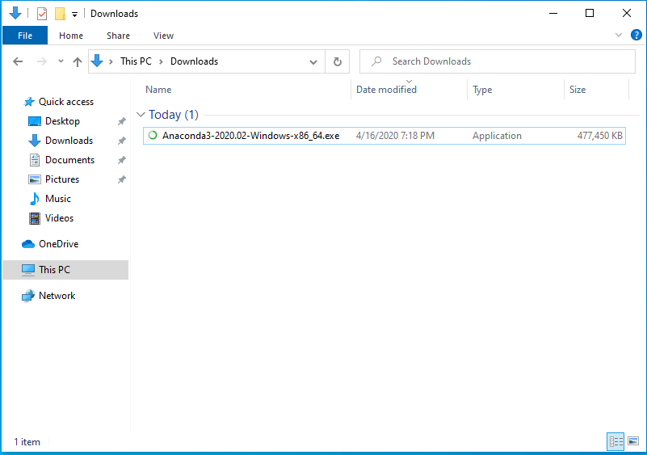
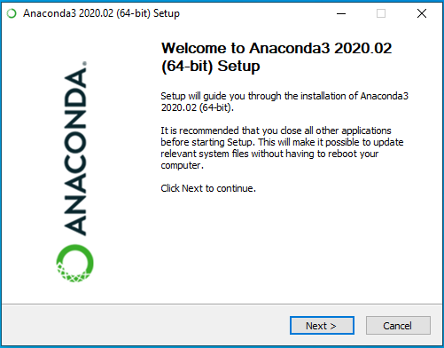
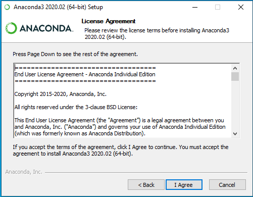
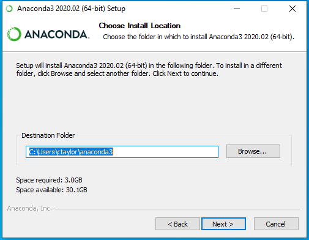
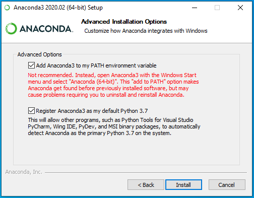
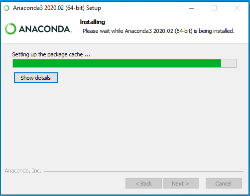
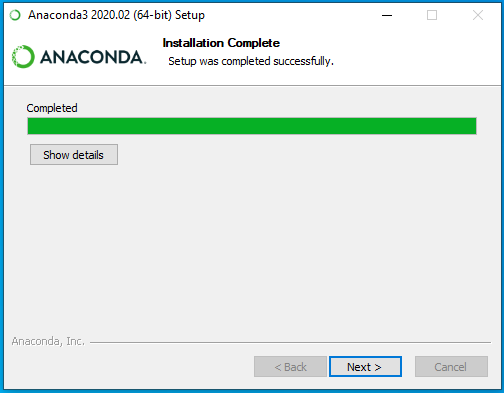
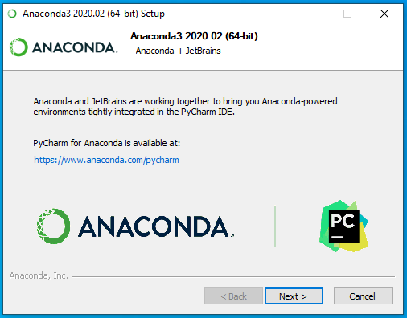

# Installing Anaconda

---

1. Download the Anaconda for Windows installer (https://repo.anaconda.com/archive/Anaconda3-2020.02-Windows-x86_64.exe).
2. Once the download is complete, run the installer (Anaconda3-2020.02-Windows-x86_64.exe).

---

On the installer splash screen, click "Next".

---

On the "License Agreement" screen, click "I Agree".

---

On the "Select Installation Type" screen:

1. Select "Just Me".
2. Click "Next".

---

On the "Choose Install Location" screen, click "Next".

---

On the "Advanced Installation Options" screen:

1. Check the box for "Add Anaconda3 to my PATH environment variable"
2. Check the box for "Register Anaconda3 as my default Python 3.7"
3. Click "Install".

---

The "Installing" window shows the installation progress.

This process will take a while.

---

On the "Installation Complete" screen, click "Next".

---

On the "Anaconda + JetBrains" screen, click "Next".

---

On the final screen:

1. Uncheck "Anaconda Individual Edition Tutorial"
2. Uncheck "Learn More About Anaconda"
3. Click "Finish".

