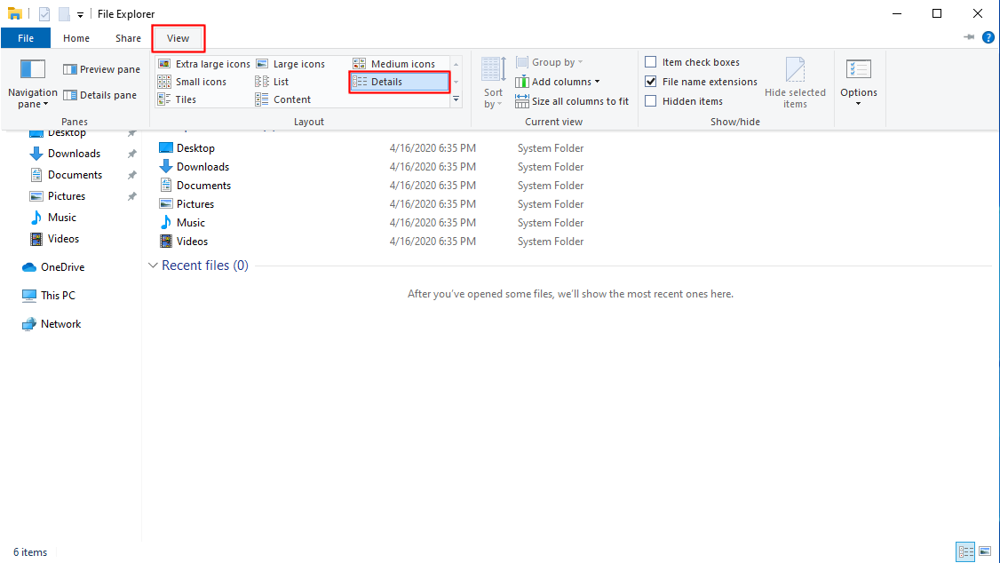

# Show File Extensions in Windows File Explorer

---

Press Windows-E to open File Explorer.

---

1. In the File Explorer window, click on the "View" button. The View pane will pop up.
2. In the "Show/hide" group of the View pane, make sure "File name extensions" is checked.

---

1. In the File Explorer window, click on the "View" button. The View pane will pop up.
2. In the "Layout" group of the View pane, select "Details."

